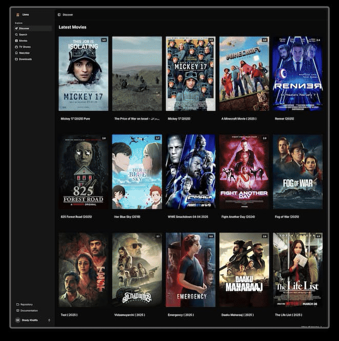

# Lionz IPTV Downloader

<p align="center">
  
</p>

A modern, high-performance IPTV content manager built with Laravel that integrates with [Lionz](https://lionz.tv) IPTV service. This tool leverages the Xtream Codes API to fetch and manage Series and VODs, uses aria2c for efficient downloading, and Meilisearch for lightning-fast content search and indexing.

## Table of Contents

- [Features](#features)
- [Prerequisites](#prerequisites)
- [Installation](#installation)
- [Configuration](#configuration)
- [Usage](#usage)
- [External API](#external-api)
- [Contributing](#contributing)
- [License](#license)

## Features

- **Smart Content Management**
    - Search and download VODs or Series (individual episodes or complete seasons)
    - Automatic media library synchronization with MeiliSearch indexing
    - Favorite series tracking with automatic new episode downloads
- **Modern Architecture**
    - Clean and responsive web interface built with React and Tailwind CSS
    - Efficient download management through aria2 integration
    - Real-time updates and notifications
- **Performance Focused**
    - Fast content searching with MeiliSearch integration
    - Efficient background job processing for media syncing
    - Optimized content delivery

## Prerequisites

Ensure you have the following installed:

- **PHP 8.4** or higher
- **[pnpm](https://pnpm.io/)** - Package manager for Node.js dependencies
- **[Composer](https://getcomposer.org/)** - PHP dependency manager
- **[Meilisearch](https://www.meilisearch.com/)** - Search engine (running on port 7700)
- **[aria2](https://aria2.github.io/)** - Download manager (running on port 6800)
    - Recommended: [Motrix](https://motrix.app/) as a GUI for aria2

## Installation

1. Clone the repository:

```bash
git clone https://github.com/shekohex/lionzhd.git
cd lionzhd
```

2. Install PHP dependencies:

```bash
composer install
```

3. Install Node.js dependencies:

```bash
pnpm install
```

4. Set up the SQLite database:

```bash
touch database/database.sqlite
```

5. Initialize the project:

```bash
composer run-script post-create-project-cmd
```

## Configuration

1. Create your environment file:

```bash
cp .env.example .env
```

2. Configure your `.env` file with the following essential settings:

```ini
# Lionz IPTV Service Credentials
XTREAM_CODES_API_HOST=your-host
XTREAM_CODES_API_PORT=your-port
XTREAM_CODES_API_USER=your-username
XTREAM_CODES_API_PASS=your-password

# MeiliSearch Configuration
MEILISEARCH_HOST=http://localhost:7700
MEILISEARCH_KEY=your-master-key

# Aria2 Configuration
ARIA2_RPC_HOST=http://localhost
ARIA2_RPC_PORT=6800
ARIA2_RPC_SECRET=your-secret-token
```

## Usage

Start the development server and all required services:

```bash
composer dev
```

This command will concurrently run:

- Laravel development server
- Queue worker for background jobs
- Log watcher
- Vite development server for frontend assets

The application will be available at `http://localhost:8000`.

### Development with SSR

For server-side rendering support:

```bash
composer dev:ssr
```

## External API

lionz.tv exposes a versioned JSON:API external API at `/api/v1`. Interactive OpenAPI documentation is available at `/docs/api`, and the machine-readable OpenAPI 3.1 document is available at `/docs/api.json`.

### Authentication

Create a scoped token from **Settings → API Tokens** at `/settings/tokens`. Copy the token once when it is created; only the hashed token is stored afterward.

Every API request must include:

```bash
Authorization: Bearer <token>
Accept: application/vnd.api+json
Content-Type: application/json
```

### Quick Start

```bash
curl -s http://localhost:8000/api/v1/me \
  -H 'Authorization: Bearer <token>' \
  -H 'Accept: application/vnd.api+json'

curl -s 'http://localhost:8000/api/v1/movies?page[size]=10&fields[movies]=name,rating' \
  -H 'Authorization: Bearer <token>' \
  -H 'Accept: application/vnd.api+json'

curl -s http://localhost:8000/api/v1/search \
  -H 'Authorization: Bearer <token>' \
  -H 'Accept: application/vnd.api+json' \
  -H 'Content-Type: application/json' \
  -d '{"q":"matrix"}'
```

### Scopes

- `read`: Browse catalog, watchlists, discovery, search, profile, and token metadata.
- `server-download`: Create movie or series episode downloads.
- `download-operations`: Pause, resume, remove, or cancel downloads.
- `monitoring:admin`: Manage automatic series monitoring and schedules.
- `admin`: Manage administrative settings and cache operations.
- `super-admin`: Perform super-admin-only user role changes.

### Endpoint Summary

- `GET /api/v1/discover`, `POST /api/v1/search`, `GET /api/v1/categories`
- `GET /api/v1/movies`, `GET /api/v1/movies/{id}`, watchlist/download/direct/cache operations
- `GET /api/v1/series`, `GET /api/v1/series/{id}`, episode download/direct, batch download/direct, monitoring operations
- `GET|POST|DELETE /api/v1/watchlist`
- `GET|PATCH|DELETE /api/v1/downloads`
- `GET|POST|DELETE /api/v1/tokens`
- `GET|PATCH /api/v1/settings/*` for admin config, sync triggers, users, and monitoring schedules

### JSON:API Behavior

Responses use `application/vnd.api+json` and contain JSON:API resource objects with `data.id`, `data.type`, and `data.attributes`. Collection endpoints include pagination `links` and `meta` when paginated. Validation and authorization failures return JSON:API `errors` objects with `status`, `title`, `detail`, and optional `source.parameter`.

Supported relationship includes include `?include=vod-info` on movie details and `?include=episodes` on series details. Sparse fieldsets use JSON:API syntax, for example `?fields[movies]=name,rating`.

The API is rate-limited to 120 requests per minute per authenticated user or token. Common error statuses are `401` unauthenticated, `403` insufficient scope or policy denial, `404` not found, `409` business action conflict, `422` validation failure, and `429` rate limited.

For implementation details, see `docs/api-architecture.md`, `docs/api-auth.md`, and `docs/adding-endpoints.md`.

## Contributing

Contributions are welcome! Please feel free to submit a Pull Request. For major changes, please open an issue first to discuss what you would like to change.

## License

This project is licensed under the MIT License - see the [LICENSE](./LICENSE) file for details.
